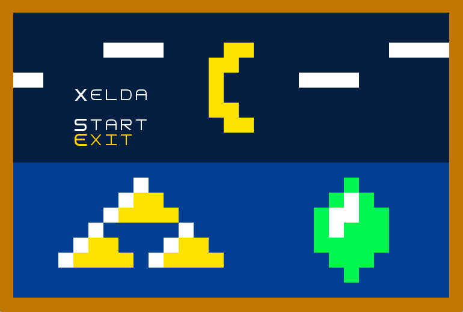
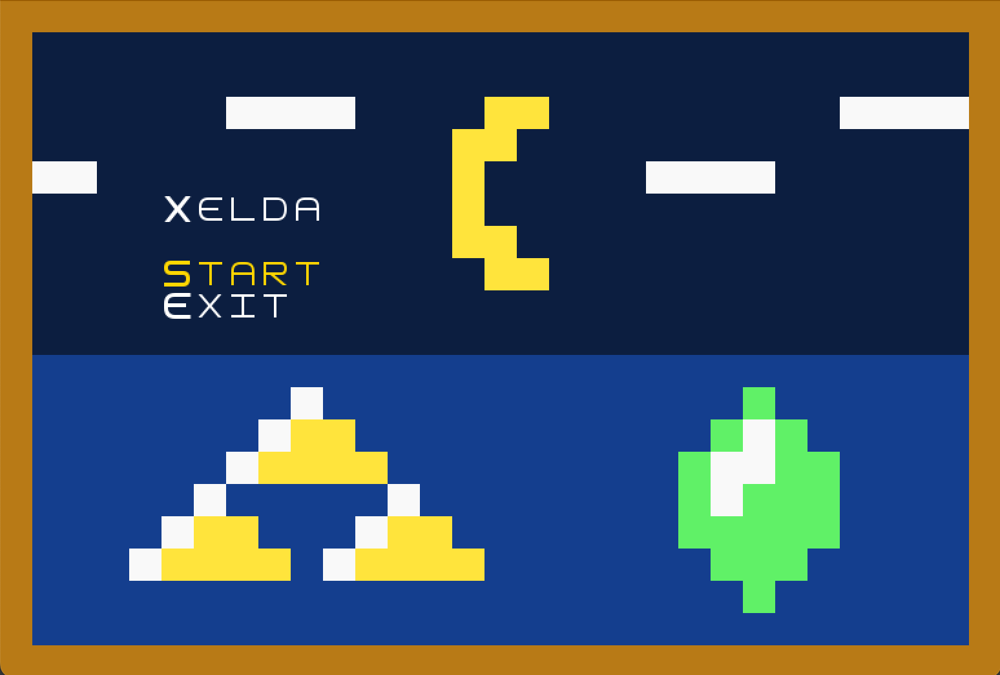
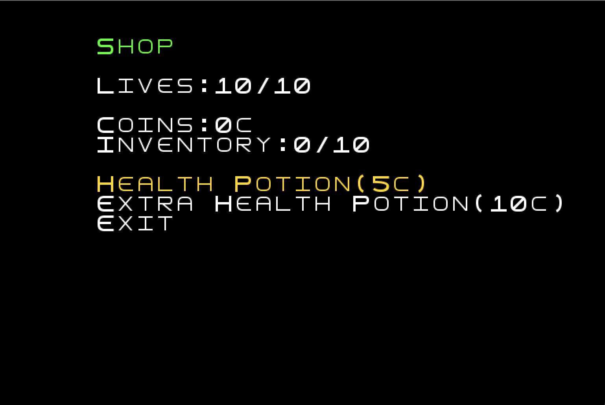
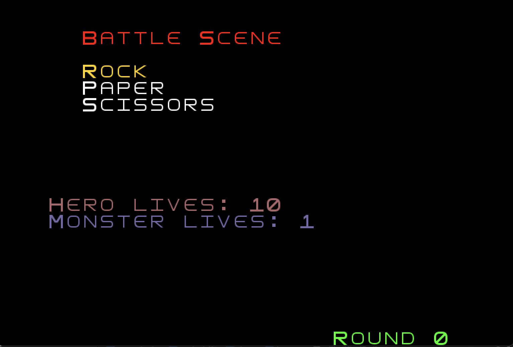
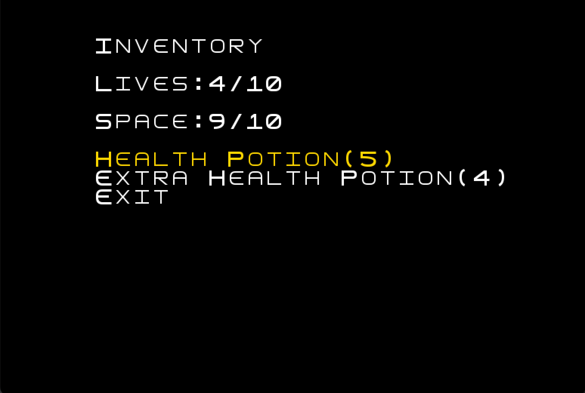
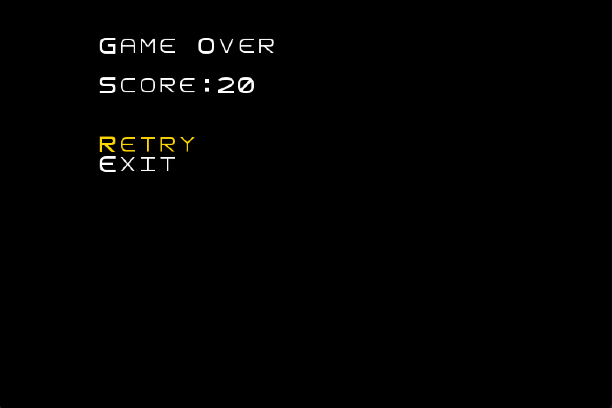
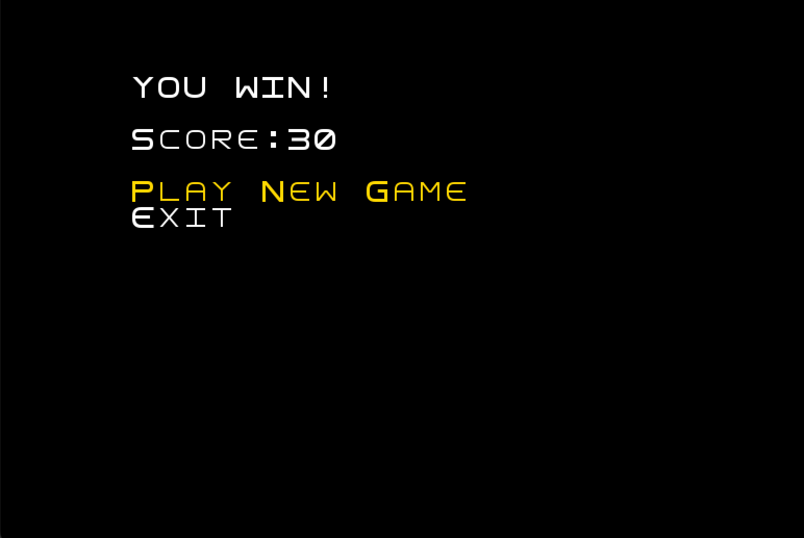

# LDTS_1604 - Xelda

## Game Description

**Xelda** is a RPG-style game inspired by the old versions of The Legend of Zelda, where you take control of our most 
loved hero : Link. Your goal is to reach the end of the maze, be careful with all the monsters and lookout for the keys
in order for you to advance in your journey. Remember, if by any chance you need some help you can always access the shop
and use the coins you've collected and in exchange you will receive items that will most certainly help you further along the road.

For a more detailed view of the project click [here](./docs/README.md).

---

## Controls 

- **Arrow-up** : Moves the character up.
- **Arrow-down** : Moves the character down.
- **Arrow-left** : Moves the character left.
- **Arrow-right** : Moves the character right.
- **Q** : Exits game.

---

## FEATURES
- [x] Menu - When the game is initialized a Menu is displayed (the player chooses between playing or quitting)
- [x] Movement - The Hero moves in all directions when the corresponding keys are pressed.
- [x] Monsters - The monsters are placed all around the map and move across randomly.
- [x] Walls - The walls are repesented in the map by the following character '#' and do not allow the hero to get off the maze.
- [x] Coins - The coins are placed around the map just like the monsters and once they're picked up by the hero,
its score is inceremented by 10 points.
- [x] Keys - One key is placed by level, it allows the Hero to open a door, access the portal and advance on his journey.
- [x] Doors - The Hero unlocks the door as soon as he collects the key corresponding to the level he is in.
- [x] Shop - The shop is represented in the map by the letter 'S' and is accessible if you press.
- [x] Potions - The are two types of potions available in the game, the first one is Health Potion that iscrements the character's lives by one, 
and the second one is the extra health potion with increases the number of total lives by equally by one.
- [x] Combat - Once the Hero encounters a monster he enters in Battle State, where the fighting mechanic consists
in a game of Rock,Paper,Scissors. If the hero loses his lives are decremented by one and he gets a new change to
defeat the monster, in case of a tie nothing happens and if the hero wins the battle the monster is killed and diseappears from the map.
- [x] Inventory - The inventory can be accessed by pressing the 'i' key and displays a menu where the hero can see all the items
he disposes of up to a maximum capacity of 10 items.
- [x] Portals - Portals allow the hero to teleport himself into the next level and are displayed in the map with the letter 'P'.

---
## Game Preview

---
## Menus
 **Main Menu**

**Shop Menu**

**Battle Menu**

**Inventory Menu**

**Death Menu**

**Win Menu**

---
## Made by

- Bruno Pinheiro (up201705562)
- Eduardo Machado (up202105337)
- Henrique Silva (up202105647)