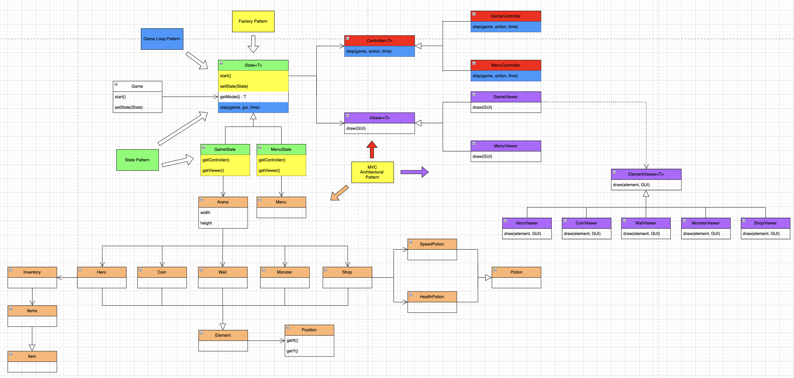
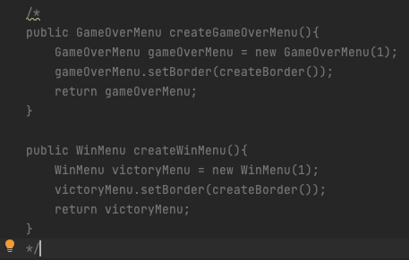
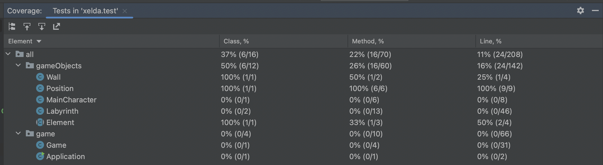
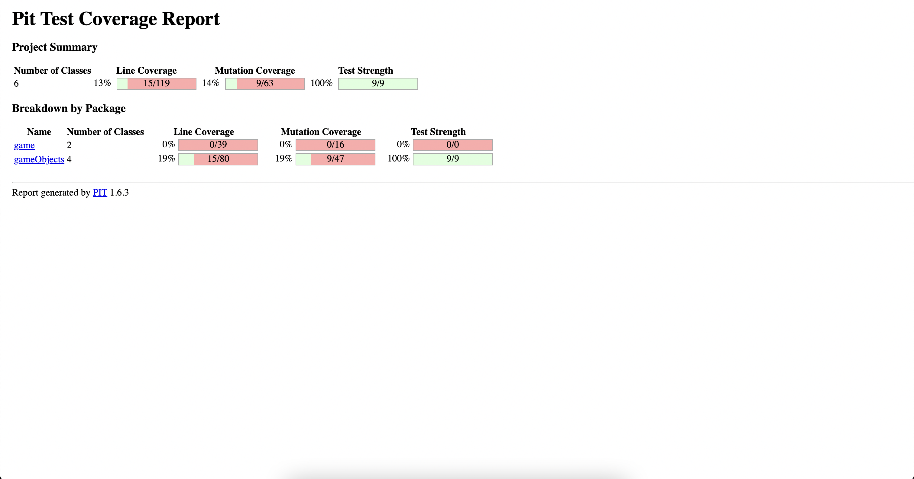

## LDTS-L16G04  <XELDA>

**Xelda Reminder:** This game is inspired by the old style Zelda games with our own twist.
The main character gets lost in a labyrinth and wants to find a way out but in his path he finds some troublesome monsters trying to capture him. 
The main character only has two options, run away or fight.

This project was developed by :
- Bruno Pinheiro (up201705562@fe.up.pt)
- Eduardo Machado (up202105337@fe.up.pt) 
- Henrique Silva (up202105647@fe.up.pt) 

for LDTS 2022/2023.

---
## Controls
- **Arrow-up** : Moves the character up.
- **Arrow-down** : Moves the character down.
- **Arrow-left** : Moves the character left.
- **Arrow-right** : Moves the character right.
- **Q** : Exits game.

---

## IMPLEMENTED FEATURES
- [x] Menu - When the game is initialized a Menu is displayed (the player chooses between playing or quitting)
- [x] Movement - The Hero moves in all directions when the corresponding keys are pressed.
- [x] Monsters - The monsters are placed all around the map and move across randomly.
- [x] Walls - The walls are repesented in the map by the following character '#' and do not allow the hero to get off the maze.
- [x] Coins - The coins are placed around the map just like the monsters and once they're picked up by the hero,
  its score is inceremented by 10 points.
- [x] Keys - One key is placed by level, it allows the Hero to open a door, access the portal and advance on his journey.
- [x] Doors - The Hero unlocks the door as soon as he collects the key corresponding to the level he is in.
- [x] Shop - The shop is represented in the map by the letter 'S' and is accessible if you press.
- [x] Potions - The are two types of potions available in the game, the first one is Health Potion that iscrements the character's lives by one,
  and the second one is the extra health potion with increases the number of total lives by equally by one.
- [x] Combat - Once the Hero encounters a monster he enters in Battle State, where the fighting mechanic consists
  in a game of Rock,Paper,Scissors. If the hero loses his lives are decremented by one and he gets a new change to
  defeat the monster, in case of a tie nothing happens and if the hero wins the battle the monster is killed and diseappears from the map.
- [x] Inventory - The inventory can be accessed by pressing the 'i' key and displays a menu where the hero can see all the items
  he disposes of up to a maximum capacity of 10 items.
- [x] Portals - Portals allow the hero to teleport himself into the next level and are displayed in the map with the letter 'P'.

---

## PLANNED FEATURES

All the planned features here previously have been implemented.

- With all these features implemented, the UML diagram should look like this:

## DESIGN PATTERNS

### ORGANIZATION OF THE CODE

**Problem in Context**

The architecture of the project is one of the most important parts of the project. Choosing the right approach is essential.
While we were organizing the project, we realized that the code would get very messy and hard to read without an appropriate structure.

**The Pattern**

We have applied the **MVC** (model-view-controller) pattern. This pattern separates the game logic from the display code, allowing us to easily fix bugs and improve code readability.

**Implementation**

The following image shows how we implemented the pattern.

**Implementation.**
- Model - Represents the data.
- View - Displays the model data, and sends user actions (user inputs, such as pressing the keyboard) to the controller.
- Controller - Provides model data to the view, and processes user actions (user inputs, such as pressing the keyboard).

**Consequences.**
- Modifications do not affect the entire model.
- Easy planning and maintenance.

------

## Refactoring
### Refactoring : Win Menu
- In order to simplify the if clause in Buypotion() method, we simply extracted the variables (Composing Method : Extract Variable)

## Code Smells
### Dead code
The game worked exactly the same way as this functions weren't being used, therefore we can say that this was a chunk of dead of dead code.

---
### TESTING

#### Coverage Report

#### Mutation Testing Report

---

### SELF-EVALUATION
- Bruno Pinheiro (up201705562): 34%
- Eduardo Machado (up202105337): 33%
- Henrique Silva (up202105647): 33%